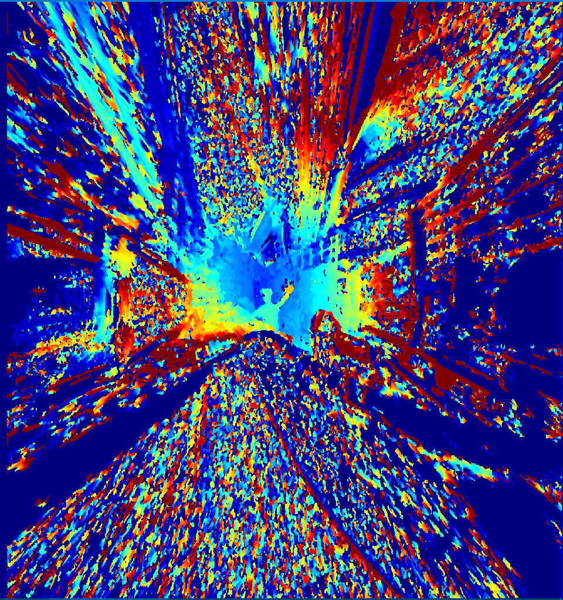

<!DOCTYPE html>
<html lang="zh-tw">
<head>
    <meta charset="UTF-8">
</head>
<body>
    <h1>stereo_camera_for_pi 專案說明</h1>
    <h2>需求 樹莓派 5 ＋兩顆魚眼鏡頭  Requires Raspberry Pi 5 + two fisheye lenses</h2>
    <h2>工作流程 Workflow ：</h2>
    <ol>
        <li>透過tcp傳送pi camera畫面.  Transmit Pi camera images via TCP</li>
        <li>用pc接收畫面 並校正單鏡頭 與 雙鏡頭立體配對.  Receive images on PC and calibrate single camera and stereo camera pairing</li>
        <li>由pi錄製raw畫面 並在pc上轉製.  Record raw images on Pi and convert them on PC</li>
    </ol>
    <h2>📁 Project Directory Structure / 專案目錄結構</h2>

<pre><code>
capture_
    capture/                        
        ├── stereo_2ssd_gpio.py            # [Pi] 使用 GPIO 按鈕啟動錄影 / Record stereo with GPIO button
    raw/                                   
        ├── player_raw_.py                 # [PC] 播放 raw 檔 / Play raw files
        ├── raw_2ssd.py                    # [Pi] 錄製 raw 影像 / Record raw files
    stereo_raw/                            
        ├── play_stereo_raw_.py            # [PC] 播放 stereo raw / Play stereo raw files
        ├── rectification_2sph_raw2mp4.py  # [PC] 轉換為等距柱狀投影並輸出 mp4 / Convert to equirectangular projection using stereo calib
        ├── rectification_raw2mp4.py       # [PC] 校正後輸出 mp4 / Calibrate + rectify stereo and output mp4
        ├── stereo_2ssd_fixed.py           # [Pi] 使用 PCIe SSD 錄 stereo raw / Record stereo raw to PCIe SSD
        ├── stereo_by_ram.py               # [Pi] 使用記憶體緩衝錄製 stereo raw / Record stereo raw using RAM buffer

tcp_
├── tcp_receive.py                # [PC] 接收並檢視單鏡頭串流畫面 / View single image stream from Pi
├── tcp_send_crop.py              # [Pi] 傳送裁切後畫面 / Send cropped single image stream
├── tcp_receive_stereo.py         # [PC] 接收 stereo 畫面 / View stereo stream from Pi
├── tcp_send_stereo_crop.py       # [Pi] 傳送裁切後 stereo 畫面 / Send cropped stereo stream

tcp_calib/
├── tcp_calib.py                  # [PC] 單魚眼鏡頭校正 / Calibrate single fisheye lens
├── tcp_fisheye_show.py           # [PC] 顯示校正後魚眼影像 / View corrected fisheye image
    stereo/
        ├── tcp_calib_stereo.py           # [PC] 雙魚眼 stereo 校正 / Stereo calibration with two fisheye lenses
        rectification/
            ├── tcp_rectification.py          # [PC] 顯示 stereo 校正後影像 / View stereo rectified images
            ├── tcp_rectification_3d.py       # [PC] 生成並顯示深度圖 / Generate and view depth maps
            ├── tcp_rectification_3d_pointcloud.py # [PC] 生成並輸出點雲 / Generate and export point clouds
            warp2sph/
                ├── tcp_rectification_2sph.py     # [PC] 轉換為等距柱狀投影 / Convert to equirectangular projection

virtual_chessboard.py         # [PC] 顯示虛擬棋盤格供校正使用 / Display on-screen chessboard for calibration

</code>
</pre>
 <h2>範例 stereo example ：</h2>
    <!-- 新增GIF範例 -->
    
    
    
</body>
</html>
